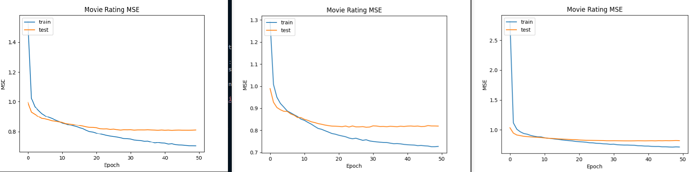
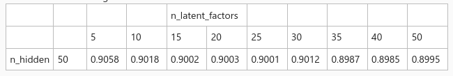

# Homework 3

* Course: Unsupervised Learning
* Homework 3
* Due Wednesday, August 4 at 6pm.

---
Problem 1
Work collaboratively with your classmates to come-up with the best performing movie recommendation system we can.

**Based on MovieLens_MatrixFactorization_Keras_7.py**

* Try different things that may improve the overall recommendation results. For example:
  * Different neural network topologies 
  * Different regularization types
  * Different optimizer settings
  * Use more / less side-info columns

**Do not limit yourself to these ideas.  You are encouraged to try anything that you think could be useful**

* Collaborate with the rest of the class on this effort:
  1. Post your changes that seem to improve things for you
  2. Try and validate the changes that other people post
  3. You should give credit to the author of the improvements (a note in the code and in the report document)
  4. We will create a Teams group chat for this purpose

* At the end of the week, you should submit code that performs as well as the best published (and validated) results in the chat.
  * You will be graded on:
      1. How well your final solution works, relative to the best published solution
          * 60 = equal to the best published solution
      2. Your positive contributions to the joint effort (new contributions + validations)
          * 5 points per positive contribution
      3. You will lose points if you:
           * Submit a solution that is inferior to the best published
           * Keep improvements to yourself, without sharing them 
           * Not citing the contributions of others that you adopted
  
# Good luck!

# My setup
* Thinkpad t14s
* CPU:  AMD 4750u PRO
* iGPU: Vega 8 Renoir
* RAM:  16GB

# Python environment

Package                 Version
----------------------- -------------------
* imbalanced-learn        0.8.0
* imblearn                0.0
* keras-nightly           2.5.0.dev2021032900
* Keras-Preprocessing     1.1.2
* matplotlib              3.4.2
* numpy                   1.19.5
* pandas                  1.2.5
* pip                     20.3.4
* scikit-image            0.18.2
* scikit-learn            0.24.2
* scipy                   1.7.0
* seaborn                 0.11.1
* tensorboard-data-server 0.6.1
* tensorboard-plugin-wit  1.8.0
* tensorflow              2.5.0
* tensorflow-estimator    2.5.0
* termcolor               1.1.0
* xgboost                 1.4.2

# Base test results

* Execution time: 280.7
* Best Test RMSE: 0.9266 at epoch 17 

# Current best results (updated 2-ago-2021 9:35pm)

Parameters:

* Factorizing into 50 latent factors
* With 100 hidden nodes
* Dropout rate first layers: 0.5
* Dropout rate second layers: 0
* Max-Norm max value: 4
* Optimizer: Adagrad.  Learning rate=0.03

Run 1:
Execution time: 394.2
Best Test RMSE:      0.8985 at epoch: 42

Run 2:
Execution time: 447.5
Best Test RMSE:      0.8984 at epoch: 30

Run 3:
Execution time: 455.3
Best Test RMSE:      0.9022 at epoch: 28

# Experiments with hidden nodes and latents factors

From professor Rojas:

After this collectives experiments we determinate that 50 hidden nodes 
and 50 latent factor are optimal for this exercise

# Key contributions credit

* Dr Rojas
* dianaponcefaerron17
* michael.cw02
* chrisajivi88 
* suscalder
* sergiosmcr
* Rafael C
* Deykel
* alcofo2191

# Validation team

Unsupervised Learning Class 2021!!!

## Texas Tech University – Costa Rica
###  Executive Education Program
